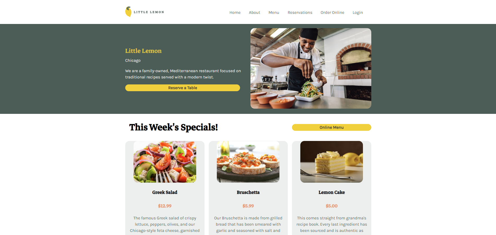
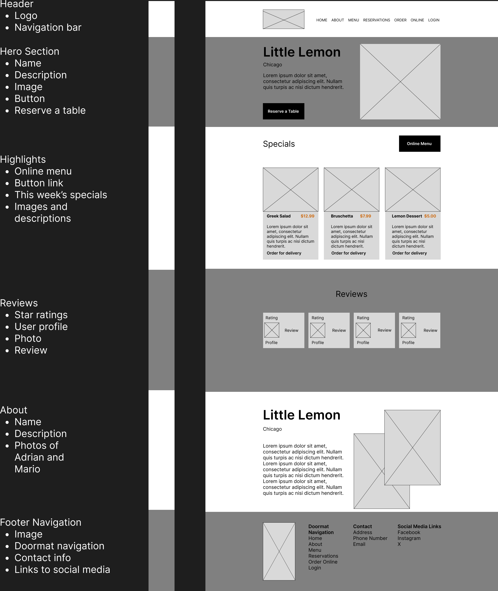
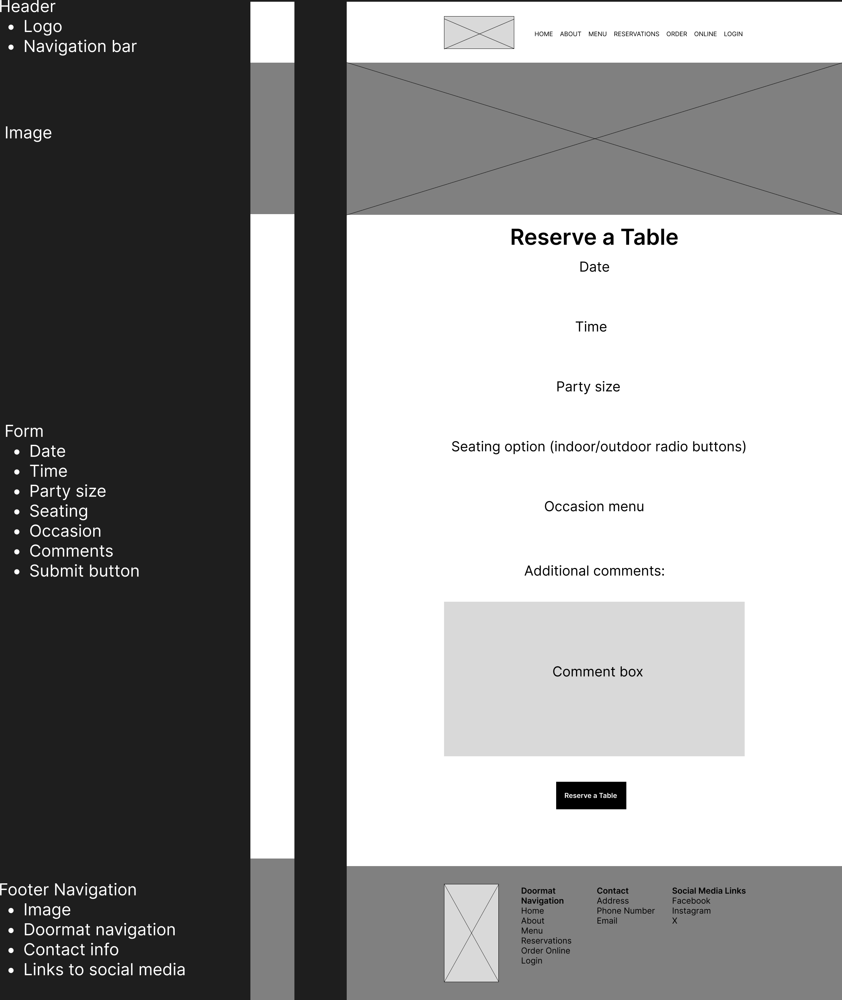
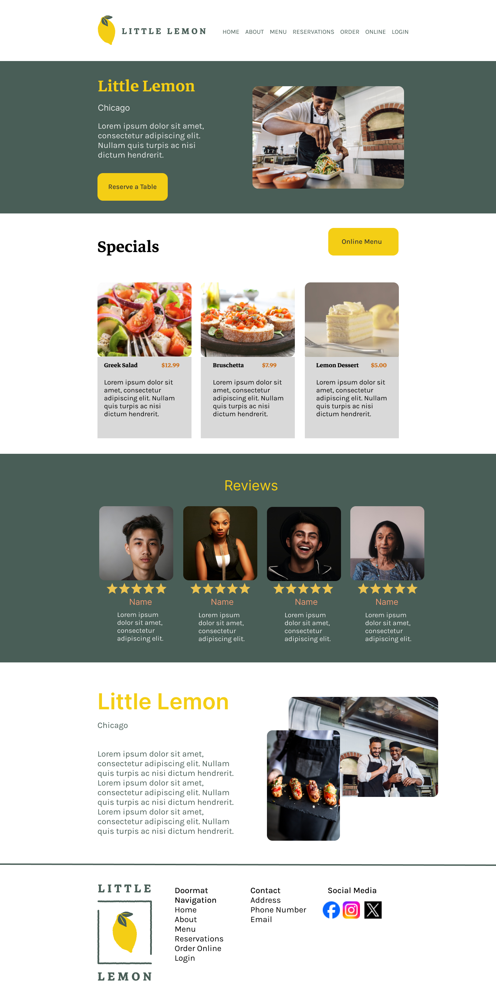
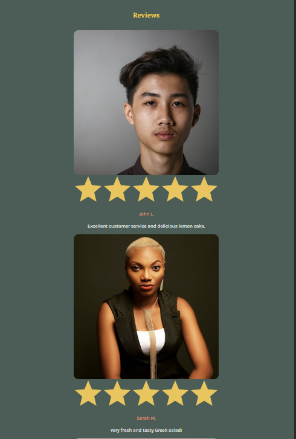
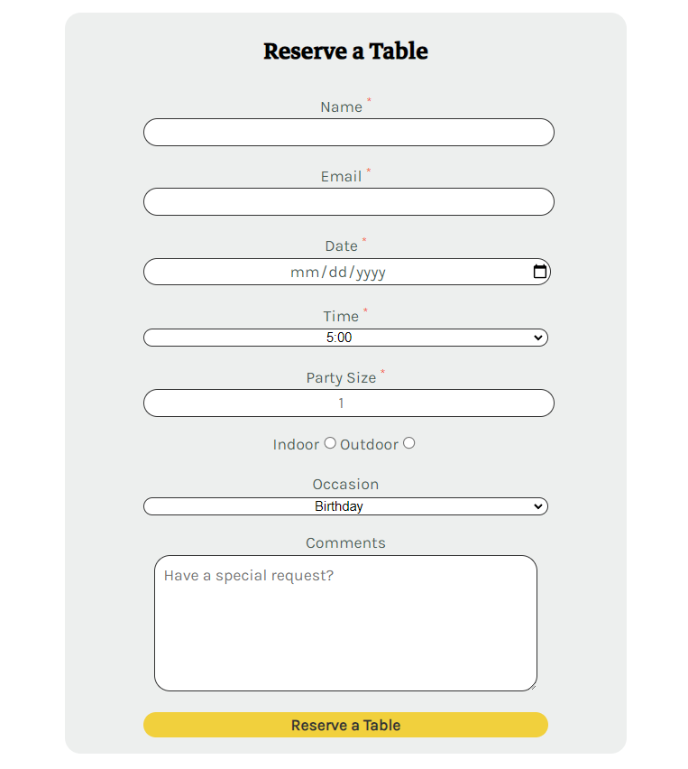

# Meta Front-End Developer Capstone

### Table of Contents

-   [About](#about)
    -   [Tools](#tools)
    -   [Design](#design)
    -   [Challenges](#challenges)
    -   [What I Learned](#what-i-learned)
-   [Features](#features)
    -   [Home Page](#home-page)
    -   [Reservations Page](#reservation-page)
-   [Getting Started](#getting-started)
    -   [Prerequisites](#prerequisites)
    -   [Installation](#installation)
-   [Contact](#contact)

# About

This was the final project in the Meta Front-End Developer Certificate on Coursera. The requirements for this project were two pages:

-   Landing page
-   Reservation page

If you would like to view the lengthy instructions for this assignment they are [here](./instructions.md).



### Tools

&nbsp;


### Design

The design for this project began in Figma. First, I created wireframes of the two required pages (home and reservation pages).

&nbsp;


I was given a brand style guide to follow which included typography, color palette, etc. All images were also provided. Using the wireframes and the style guide, I made a mockup of the home page in Figma. While using Figma was not my favorite part of this project, having a design to follow helped the coding process a lot.



### Challenges

Since I had a style guide to follow and my mockup, once I began coding I felt it was fairly straightforward for the most part. There were a couple areas of the project that I struggled on. For populating the booking times we were supposed to connect the bookings page to an API. However, I couldn't get this to work and later found out that the link was broken on the class forums. I also struggled with the useReducer hook as it seemed like a more confusing way of using useState and the course only briefly covered it. We were also supposed to write unit tests which I wasn't sure why mine kept failing. Unit tests are something I added to my list of things to study more of in the future.

### What I Learned

It was interesting to see and learn all of the different stages of this project from the ground up. From starting with a user story and using Figma to coding the layout, design, and functionality. I realized that the process takes a lot of time and has many different stages.

I also had to stay organized with all the files for this project and frequently commit my progress using Git.

Concepts learned/practiced:

-   Figma (wireframe, mockup, style guide)
-   CSS grid
-   React router
-   Media queries
-   Form validation
-   useState, useLocation

# Features

### Home Page



Features:

-   media queries
-   hamburger nav menu for smaller screens
-   react router for page navigation

### Reservation Page



Features:

-   state management
-   controlled component
-   form validation (disabled button, required inputs)
-   email validation (must include @)
-   date validation (must select future date)

# Getting Started

### Prerequisites

To get the project running on your machine, you'll need to have the following installed:

-   [Node.js](https://nodejs.org/)
-   [npm](https://www.npmjs.com/) or [Yarn](https://yarnpkg.com/)

### Installation

1. Clone the repository to your local machine:

```
git clone https://github.com/mshortcodes/meta-capstone.git
```

2. Change into the project directory:

```
cd meta-capstone
```

3. Install dependencies using npm:

```
npm install
```

4. Run the development server:

```
npm start
```

# Contact

Michael Short - mshortcodes@gmail.com

Project link: https://meta-capstone.vercel.app/
